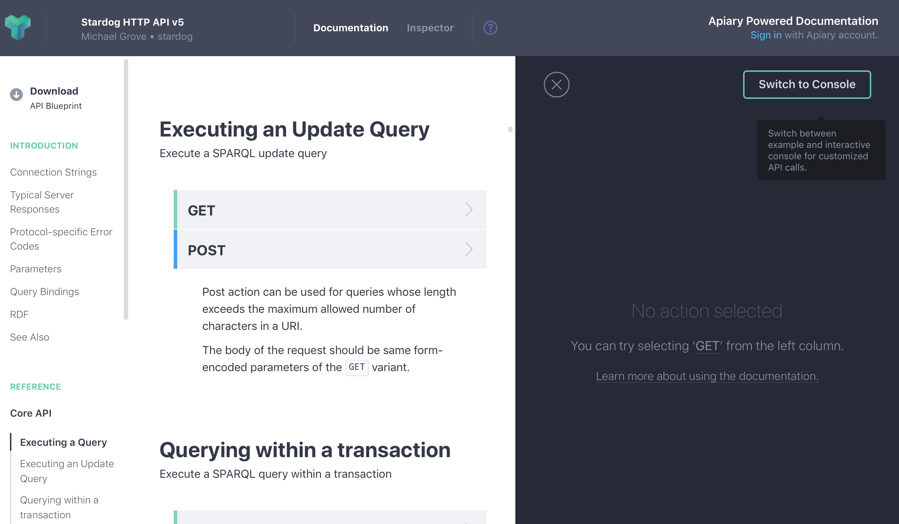

# Storing Semantic Information [Aitor Corchero Rodiguez]
> How to store semantic information, making it accessible for later processing.

Commonly, semantic information is stored in triple or quad stores. The first step before storing the information is to select most suitable triple or quad stores depending on the type of inferences, time of performing SPARQL Queries or the expected  information size to be stored. To perform this initial task, it is common to analyse triple/quad stores benchmarks. Several benchmarks are being collected and published by W3C[^https://www.w3.org/wiki/RdfStoreBenchmarking]. This Wiki pages collects W3C performed benchmarks considering different ontologies (BSBM, LUBM, UOBM, SIB, DBpedia Benchmark, etc). Moreover, it also collects third parties benchmarks. The latest benchmarks performed by the W3C corresponds to 2018 (most updated ones). As contrary, the latest third parties benchmarks are dated 2015[^http://www.semantic-web-journal.net/system/files/swj954.pdf]. Considering latest results, a small summary of the different triple stores are: 

| Large Triple(Quad) Stores | Inferences | License | Bechmark |Max. Triples| SPARQL Query Performance |
|----|----|----|----|
| Oracle Database 12c | RDFS | Propietary | LUBM | 1.08 Trillion | 4.18 Billion (2.53h) |
| Allegro Graph| RDFS | Propietary/Comercial |Custom | 1 Trillion | N/A |
| Stardog | OWL | Comercial/Community edition | 50 Billion | N/A |
| Openlink Virtuoso |Comercial/Community edition| RDFS/OWL | Mighty Storage Challenge |36.9 Billion | 15000 operations (95.50ms) |
|GraphDB| OWL |Comercial/Community edition| DBPedia benchmark |17 Billion | 53000 operation (1h) |
| Garlik 4 store| RDF| N/A | Custom | 15 Billion | N/A |
|Blazegraph| RDF | Open Source |Mighty Storage Challenge | 12.7 Billion | Unable to finish|
| JenaTDB | OWL | Open Source | DBPedia benchmark | 1.7 Billion | 100Million (around 100s) |
| RDFox | OWL | Open Source | N/A | 1.6 Billion (in-memory-store) | N/A|
| Mulgara | RDF | Open Source | N/A | 500 Million | N/A|
| Kowari | RDF | Open Source | N/A | 160 Million | N/A|

As depicted in the previous table, there is no common benchmark to evaluate all the triple-stores. However, the selection of a triple store will be fundamentally based on the type of inferencing you need in the project (RDF, RDFS, OWL), the type of the project (commercial or open source) and the initial information capacity expected for your application. Other key aspects to have in mind at time of selecting a semantic store is the performance capacity. That means, how the semantic store perform the inferences and where the information is stored. A big lack of the semantic stores is that they needs huge resources to perform the corresponding inferencing, process and load the information. This main lack is derived mainly by the mix of storing the information in different files and in-memory. 

Once the semantic repository is selected, the next step is to download and install it. Nowadays, a common practice is to use Docker as a tool to create a development environment to isolate application in form of containers[^https://www.docker.com]. 

Even the method selected, we are able to run the semantic repository. All shown semantic repositories corresponds to a server with a frontend. So, they usually provide common commands and front-end to load and query the information. Moreover, it also provide an API to connect the semantic store to our programs even directly using libraries (Jena, RDF4J, RDFLib, etc) or through Rest services (HTTP Requests and responses). A common recommendation is to use the commands to load and update the information when large data-sets are present. We recommend to use the user-interface when static data are only present or for testing purposes. 

When the semantic store is filled, the exploration and accessibility to the information is performed through SPARQL endpoints commonly. This SPARQL endpoints are accessible via HTTP in a from-end where the SPARQL queries could be directly defined to explore and access the stored information. The queried information could be serialised in different formats such as JSON-LD, Turtle, RDF/XML, TSV, CSV, N3, etc. When the end-points serves the information to the applitions, it is common to use the API fr the SPARQL query. This API commonly is available through the commented semantic libraries or via HTTP request/responses. One method used to know the HTTP operations that an endpoint offers is through Apiary site or similar API documentation tools [^https://stardog.docs.apiary.io/#introduction/rdf].

Once we have a common overview on how works the semantic stores,   the next paragraphs will be devoted to practice with the presented example. 

- [ ] TODO: Select one semantic store (Fuseki?)
- [ ] TODO: Load some triples based on the example (JAVA, PYTHON?). 
- [ ] TODO: Explore the inforamtion using SPARQL queries and some small program (JAVA, PYTHON?)

